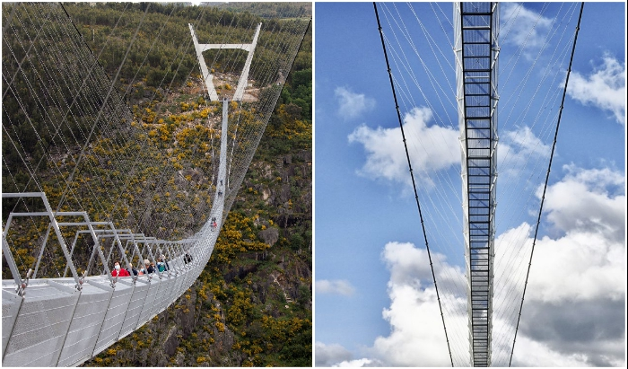
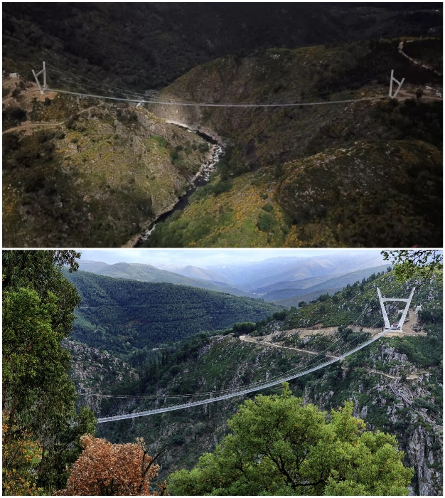
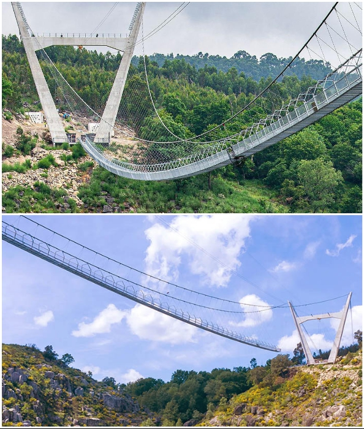
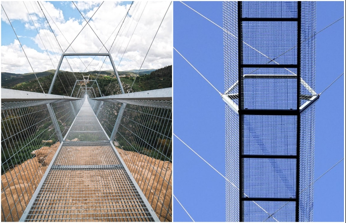

# The world's longest suspension bridge is about to open in Portugal

The construction of the longest suspension bridge in the world was completed. This time the record was broken by Portugal, although its builders still used the technology of the Chinese. Really extreme attraction of 516-meter length connected Aghieiras Falls and Paiva Gorge. Now instead of hours of crossing, it will only take 10 minutes, but even they will be a real challenge for tourists. Despite the fact that the official opening will take place a little later, locals have already experienced the full range of emotions of crossing over the deep gorge and the rushing river.

The residents of the city of Aruca, in northern Portugal, recently had the unique opportunity to be the first to cross the longest suspension bridge in the world, which will soon open to tourists. This spectacular attraction appeared amidst the picturesque mountainous landscape of Arouca Geopark, a UNESCO World Heritage Site. The 516-meter-long suspension footbridge connects Aguijeras Falls and Paiva Gorge, considered the park's most spectacular natural attractions.

As the pioneers say, you don't even have to be afraid of heights to feel the terror of the 175-meter-deep gorge and the rushing river beneath your feet, because the walkway is created in the form of a lattice. And if you add to this the fact that the construction of the suspension bridge is not stable, and is constantly swinging from the gusts of wind and the movement of people, it becomes clear why the adrenaline rush is off the scale.

To create a reliable pedestrian crossing at a considerable height and with such a length, the Portuguese engineers and architects used the Chinese bridge construction technology, because in this area they have no equal. The bridge, named 516 Arouca Bridge, is designed in the Tibetan style, with the deck suspended on steel cables attached to two massive V-shaped pylons.

The walkway and railings are made of rigid steel in the form of grids with large meshes. Such an extreme attraction is created for thrill-seekers to enjoy the frightening gorge underfoot, stormy waters of the River Paiva and the beauty of lush greenery covering the mountain slopes and a delightful waterfall.

- Interesting fact from the editors: Portuguese studio Itecons took three years and $2.8 million to complete the bridge by July 2020. 

`"The bridge in the geopark didn't just appear for nothing; it is part of a larger strategy to encourage as many people as possible to move to the region and stay there to live and work,"` says Margarida Belén, mayor of Aruca. There were a lot of challenges that we had to overcome. But we did it. Now there is no other bridge in the world like it.

